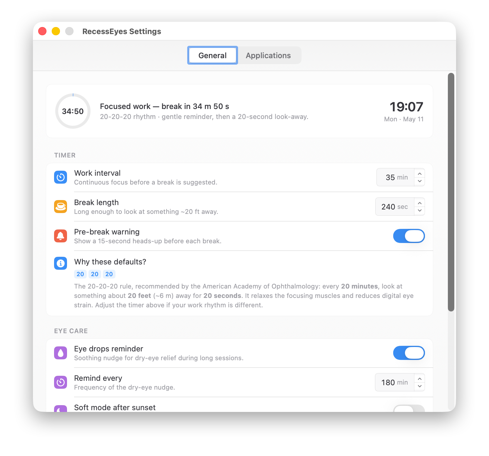
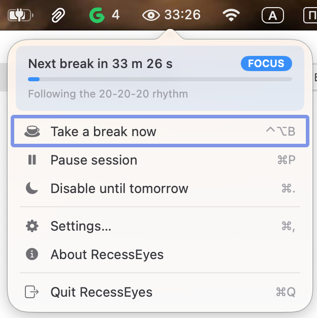

# RecessEyes

Mindful break timer for macOS. Reminds you to follow the **20-20-20 rule** —
every 20 minutes, look at something ~20 feet (6 m) away for 20 seconds — to
relax focusing muscles and reduce digital eye strain.

<p align="center">
  
</p>

<p align="center">
  
</p>

## Features

- Full-screen overlay across all displays during breaks
- Eye drops reminder on a separate cadence
- Auto-pause when "light" apps are focused (configurable)
- Auto-pause on system inactivity, smart resume after sleep/wake
- Lock screen during a break — break is finished automatically on unlock
- Soft chime when the break timer reaches zero (boosted +12 dB so you hear it
  from across the room)
- "Soft mode" tint after sunset
- Launch at login
- 5 languages: English, Русский, Español, Azərbaycan, فارسی

## Install

Download the latest `RecessEyes-X.Y.dmg` from [Releases](https://github.com/korenskoy/RecessEyes/releases), mount it, and drag
**RecessEyes.app** to **Applications**.

Disable **GateKeeper** by entering the following command in the Terminal:

```bash
sudo xattr -r -c /Applications/RecessEyes.app
```

## Build from source

Requirements: Xcode 15+ on macOS 14+.

```bash
# Build Release and install to /Applications
./scripts/build_release.sh

# Build Release and package as a DMG into dist/
./scripts/build_dmg.sh
```

`build_release.sh` auto-bumps `CURRENT_PROJECT_VERSION` in
`RecessEyes/Version.xcconfig` on every run.

## License

[MIT](LICENSE) © Anton Korenskoy
